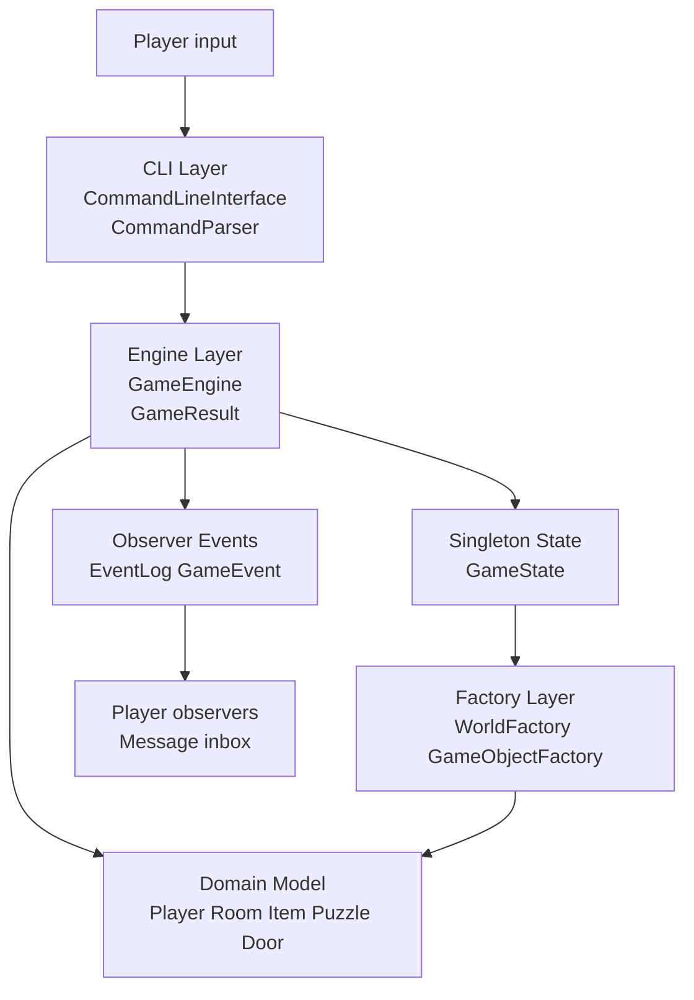
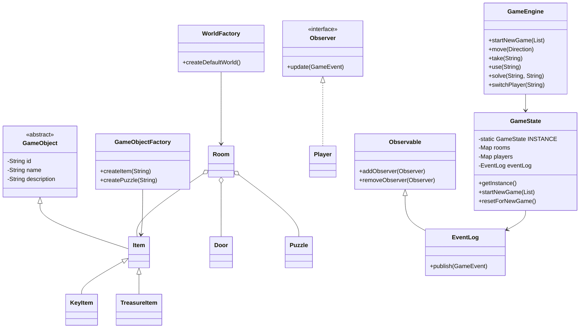

# CS1OPNU CW1 Project

Module Code: CS1OPNU

Assignment report Title: Project

Student Number: TODO

Actual hrs spent for the assignment: TODO

Which Artificial Intelligence tools used: ChatGPT/Codex was used to support the project planning, test planning, and the design of the Observer event notification structure. The code should be reviewed, understood, tested, and adapted by the student before final submission.

## Overview

This project is a Java command-line multi-player text adventure game. Players explore an abandoned observatory, collect items, solve a puzzle, unlock restricted areas, and work toward a shared win condition. The game is designed to demonstrate object-oriented programming, layered software design, unit testing, and three software design patterns: Singleton, Observer, and Factory.

## Build and Run

```powershell
mvn clean test
mvn exec:java
```

If Maven is not installed globally on Windows from this workspace, use:

```powershell
..\.tools\apache-maven-3.8.8\bin\mvn.cmd clean test
..\.tools\apache-maven-3.8.8\bin\mvn.cmd exec:java
```

## Implementation Highlights

The project implements a local multi-player text adventure game set inside an abandoned observatory. Two players, Alice and Bob, can take turns in one shared command-line session. The game world contains multiple connected rooms, including an entrance hall, library, workshop, control room, and vault. Players can inspect rooms, move between locations, collect items, solve a console puzzle, unlock a restricted room with a key, and win by recovering the Star Crystal.

The implementation uses a layered structure. The CLI package parses and routes user commands, the engine package applies game rules, the model package represents domain objects, the events package implements Observer notifications, and the factory package creates objects and builds the default world. This keeps user interaction separate from the core game logic and makes the code easier to test.

The required design patterns are implemented explicitly. `GameState` is a Singleton that provides one shared state for the rooms, players, active player, event log, and win condition. The Observer pattern is implemented through `Observable`, `Observer`, `GameEvent`, and `EventLog`, allowing players to receive messages when game events occur. The Factory pattern is implemented through `GameObjectFactory` and `WorldFactory`, which centralise creation of items, puzzles, rooms, exits, and the default map.

The test suite uses JUnit 5 and covers domain objects, movement, inventory management, puzzle progression, the win condition, command parsing, Factory creation, Observer notification, and Singleton behaviour.

## Requirements

Priority 1:
- Implement a structured game world with multiple connected rooms.
- Allow multiple players to take turns in a shared game session.
- Support core commands: `look`, `go`, `take`, `inventory`, `switch`, `use`, `solve`, `players`, `help`, and `quit`.
- Implement a clear win condition.

Priority 2:
- Use Singleton, Observer, and Factory patterns.
- Use object-oriented domain classes with inheritance and composition.
- Separate CLI, game engine, model, factory, and event logic.

Priority 3:
- Add JUnit 5 unit and integration tests.
- Provide setup, run, and test instructions.
- Document design assumptions and architecture diagrams.

## Design

### Architecture Diagram



### Class Diagram



### Design Patterns

Singleton:
- `GameState` provides a single authoritative state object.
- It stores the world, players, active player, event log, and game outcome.
- `resetForNewGame()` is included so tests and a new game can start from a clean state.

Observer:
- `Observer` defines the notification contract.
- `Observable` manages registered observers.
- `EventLog` publishes events and stores event history.
- `Player` implements `Observer` and receives event messages.

Factory:
- `GameObjectFactory` creates item and puzzle objects from template IDs.
- `WorldFactory` creates the default room map and places objects.
- This keeps object creation outside the game engine.

## Assumptions

- Networking is not implemented because the assignment marks it as optional.
- Multiple players are supported through turn switching in one shared CLI session.
- The game uses Java 8-compatible syntax because the available local JDK is Java 8. The code can also run on newer JDKs.
- The command-line interface is intentionally simple so the project focuses on object-oriented design, patterns, game logic, and testing.
- Student number and final hours spent should be filled in by the student before submission.

## Example Commands

```text
look
go north
take note
switch Bob
go east
take brass_key
solve console ORION
use brass_key
go east
go north
take star_crystal
```

## Testing

Run all tests:

```powershell
mvn clean test
```

Or, from this workspace without global Maven:

```powershell
..\.tools\apache-maven-3.8.8\bin\mvn.cmd clean test
```

The test suite covers:
- Singleton state management.
- Observer event notification.
- Factory-created items, puzzles, and world map.
- Player movement and player switching.
- Inventory management.
- Puzzle solving and locked-door progression.
- Win condition.
- CLI command parsing.