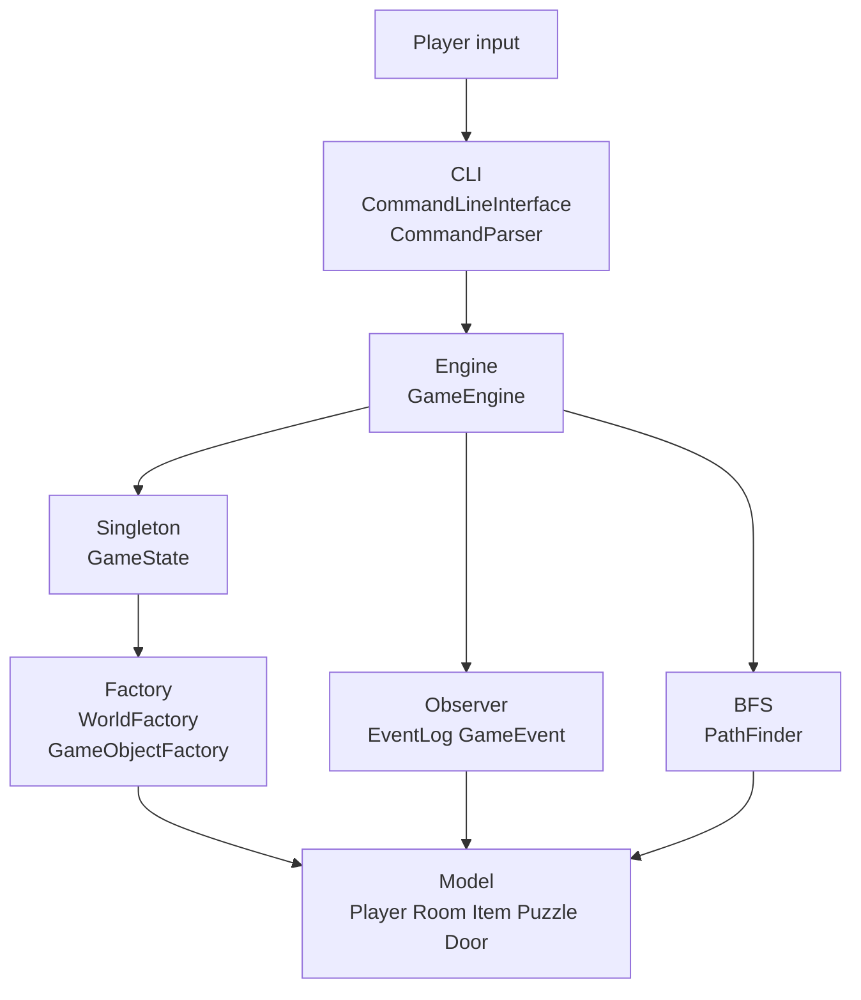
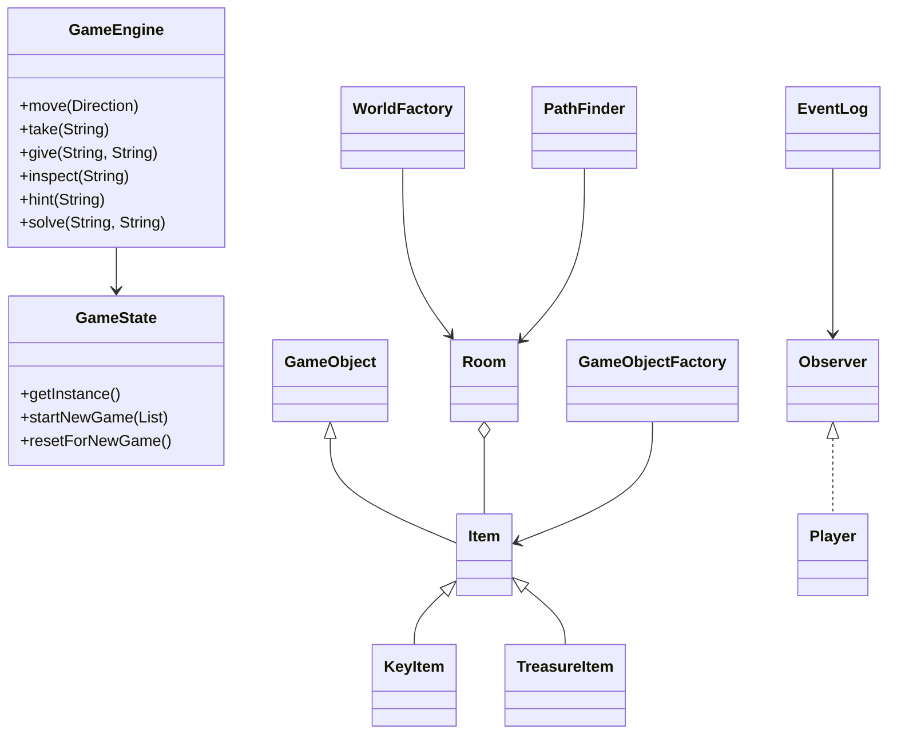

# CS1OPNU CW1 Project

Module Code: CS1OPNU

Assignment report Title: Project

Student Number: TODO

Actual hrs spent for the assignment: TODO

Which Artificial Intelligence tools used: ChatGPT/Codex was used to support planning, test design, and the Observer pattern structure. The implementation should be reviewed, understood, tested, and adapted by the student before submission.

## Introduction

This project is a Java command-line multi-player text adventure game set in an abandoned observatory. Alice and Bob share one game world and take turns using commands such as `look`, `inspect`, `go`, `take`, `give`, `hint`, `use`, and `solve`. Players explore connected rooms, collect objects, transfer items to each other, solve a console puzzle, unlock the control room, and win by recovering the Star Crystal.

The implementation focuses on object-oriented design, layered software structure, the Singleton, Observer, and Factory patterns, and JUnit 5 testing. Networking is not implemented because it is optional in the specification.

## Implementation Highlights

The game is organised into clear layers. The CLI package parses and displays commands, the engine package enforces rules, the model package stores domain objects, the events package implements Observer notifications, and the factory package builds game objects and the world map. This separation keeps the command-line interface independent from the game rules and makes the core logic testable.

The project extends the basic adventure requirements with collaborative item transfer and route hints. `give <item> <player>` lets players cooperate directly, while `hint <target>` uses breadth-first search to find the shortest currently available route to a room or item.

## Requirements

Priority 1:
- Structured world with connected rooms, items, puzzle, locked door, and win condition.
- Multiple players in one shared session.
- Commands for movement, inspection, inventory, player switching, item transfer, hints, puzzle solving, and quitting.

Priority 2:
- Explicit Singleton, Observer, and Factory pattern implementations.
- Object-oriented classes using inheritance and composition.
- Layered design separating CLI, engine, model, events, and factories.

Priority 3:
- JUnit 5 unit and integration tests.
- README setup, design diagrams, assumptions, and testing notes.

## Design





## Design Patterns

Singleton: `GameState` is the single shared source of truth for players, rooms, active player, event log, and win state.

Observer: `EventLog` extends `Observable` and notifies `Player` observers when players move, take items, give items, solve puzzles, unlock doors, or win.

Factory: `GameObjectFactory` creates item and puzzle templates, while `WorldFactory` creates the default room graph. This keeps object construction out of the engine.

## Algorithm and Performance

The world is represented as a graph: rooms are nodes and exits are edges. `PathFinder` uses breadth-first search for `hint <target>`. Since all exits have equal cost, BFS finds the shortest available route in `O(V + E)` time. It only follows exits where `Room.canExit(direction)` is true, so locked doors are not suggested.

Other structures are chosen for simplicity and efficiency: rooms use `Map<String, Room>` for average `O(1)` lookup, room items use `Map<String, Item>` for average `O(1)` lookup/removal, and exits use `EnumMap<Direction, String>` because directions are fixed enum values.

## Assumptions

- Multiplayer is implemented as turn switching in one shared CLI session.
- Networking is omitted because it is optional.
- Java 8-compatible syntax is used so the project runs on the available local JDK and newer JDKs.
- Student number and actual hours must be filled in before submission.

## Build, Run, and Test

```powershell
mvn clean test
mvn exec:java
```

If Maven is not installed globally in this workspace:

```powershell
..\.tools\apache-maven-3.8.8\bin\mvn.cmd clean test
..\.tools\apache-maven-3.8.8\bin\mvn.cmd exec:java
```

Example playthrough:

```text
look
inspect room
go east
take brass_key
give brass_key Bob
switch Bob
solve console ORION
use brass_key
hint star_crystal
go east
go north
take star_crystal
```

## Testing Strategy and Edge Cases

The JUnit 5 suite covers domain classes, command parsing, Singleton state, Observer events, Factory construction, BFS pathfinding, item transfer, inspection, inventory, movement, puzzle progression, and a full two-player flow. Edge cases include invalid exits, missing items, item transfer between different rooms, wrong puzzle answers, unknown players, locked doors, missing hint targets, and zero-length hint paths.